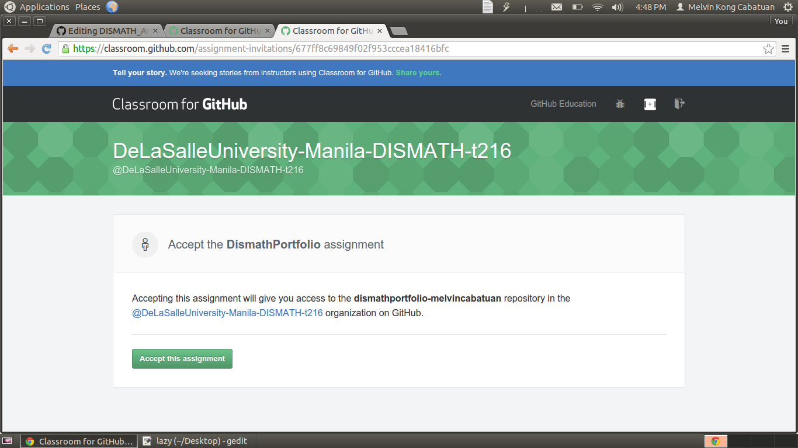
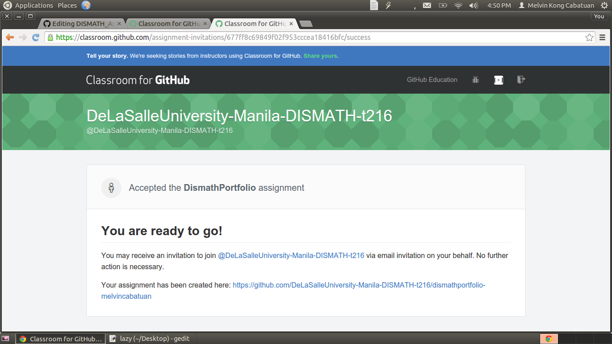
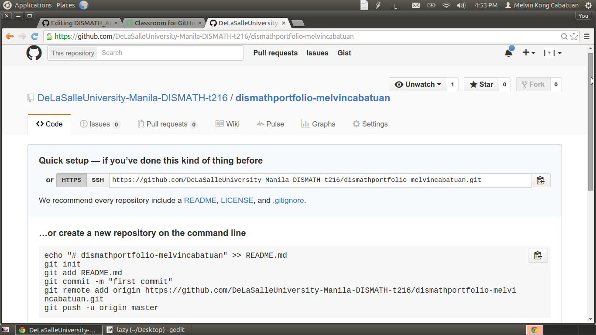
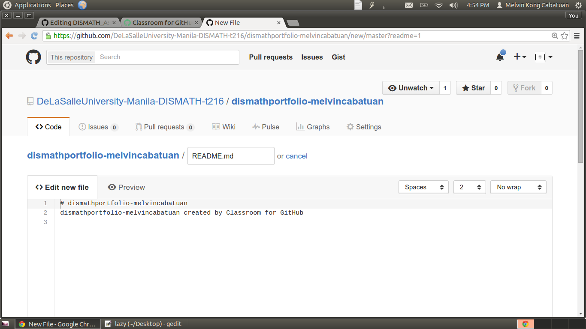
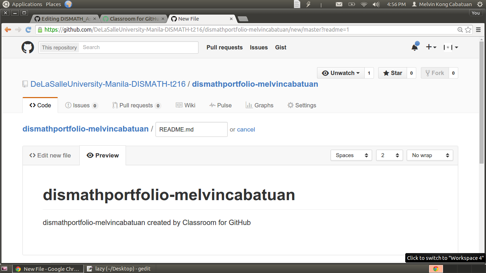
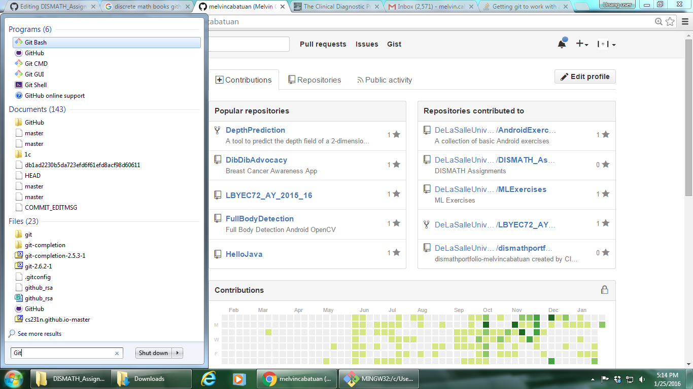
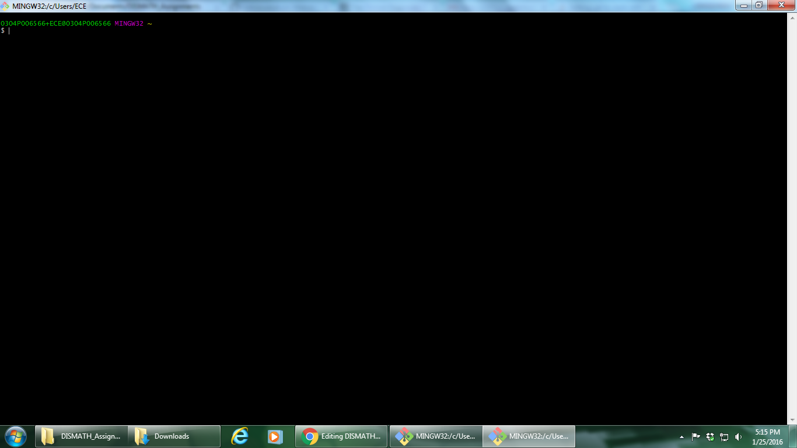
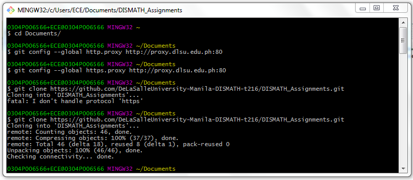
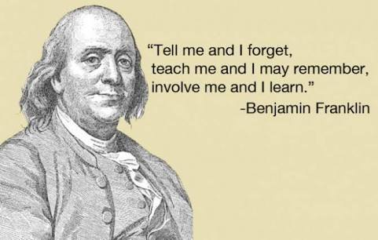

# DISMATH Assignments Collection

1. Evaluate the validity of the following argument:
> " *Superman were able and willing to prevent evil,
he would do so. If Superman were unable to prevent
evil, he would be impotent; if he were unwilling
to prevent evil, he would be malevolent. Superman
does not prevent evil. If Superman exists, he is neither
impotent nor malevolent. Therefore, Superman
does not exist*."

2. DISMATH Online Portfolio
  - Join the classroom by clicking the following link: 
  
    https://classroom.github.com/classrooms/16584600-delasalleuniversity-manila-dismath-t216

  - Click the following link to create a repository: 
  
    https://classroom.github.com/assignment-invitations/677ff8c69849f02f953cccea18416bfc

  - Click 'Accept this assignment'
  
  	
  
  - Click the assignment link. 
  
    Ex. 'https://github.com/DeLaSalleUniversity-Manila-DISMATH-t216/dismathportfolio-yourUserName'

	

  - You will be directed to your own repository.
  
    Ex.
    

  - Just click 'README' link and start writing what you have learned in this course.
  
    Ex.
    

  - You can click 'Preview' link to preview your written portfolio.
  
  	Ex.
  	
  
  - Click the 'Edit new file' again to continue editing.
  
  - GitHub uses 'GitHub Flavored Markdown' and the hashtag symbol (\#) marks headings.
  
  - For the portfolio, the only formatting requirement is **WEEKLY headings with itemized weekly learnings limited to ONE sentence per item**. (Of course, nobody will mind if you will show off with nice markdown tricks like linking/embedding images or perhaps creating tables, etc., but they're not required).
  
    Ex. https://github.com/DeLaSalleUniversity-Manila-DISMATH-t216/dismathportfolio-melvincabatuan/tree/master 

  - Note: You can refer to the following link for a very basic introduction to GitHub flavored Markdown:
  
    https://help.github.com/articles/markdown-basics 

  - When done making changes, click 'Commit changes'
  
  - When you have already clicked the 'Commit changes' button but still want to change something then just click the 'Pencil icon' on the top right which means 'edit'.

  - Repeat the process of writing and editing until the term ends. By then, you have completed your DISMATH portfolio.
  
  - Backup your portfolio to your desktop/laptop with the ff. procedures:
  	
	- Download Github desktop from https://git-scm.com/download/win .
	- Click the Git-2.7.0-32-bit.exe, Click 'Run', and Click 'Next' on all options for the default.
	- Search 'Git ' in the 'Search programs and files'.
	
	- Click 'Git bash'
	
	- Change directory to Documents by typing the ff. command 'cd Documents'
	- Clone your repository by typing the ff. command 'git clone https://github.com/DeLaSalleUniversity-Manila-DISMATH-t216/dismathportfolio-YourOwnUserName.git' 
	
	- Note 1: Replace 'YourUserName' with your own username
	- Note 2: If you are behind DLSU proxy, then set-up the http proxy by typing the command 'git config --global http.proxy http://proxy.dlsu.edu.ph:80' 
	- Note 3: If you are behind DLSU proxy, then set-up the https proxy by typing the command 'git config --global https.proxy http://proxy.dlsu.edu.ph:80'

3. ToBeAnnounced...

